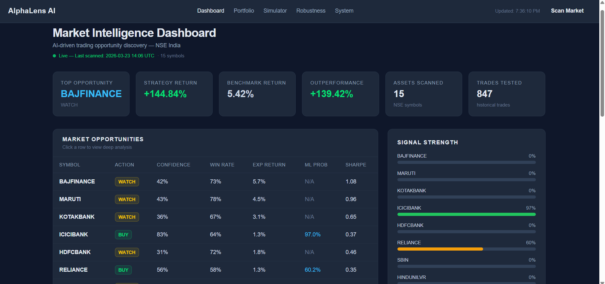
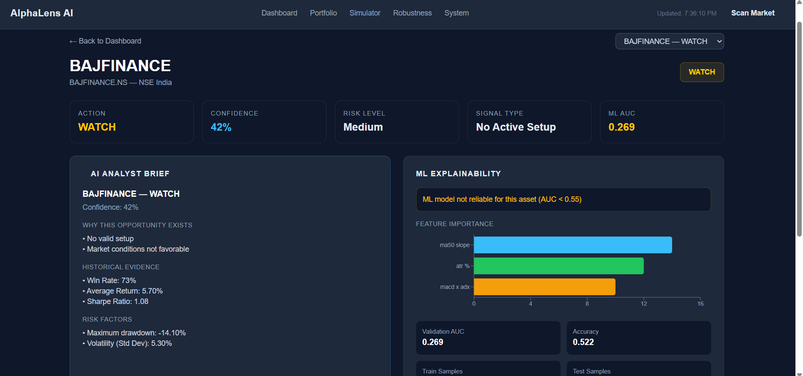
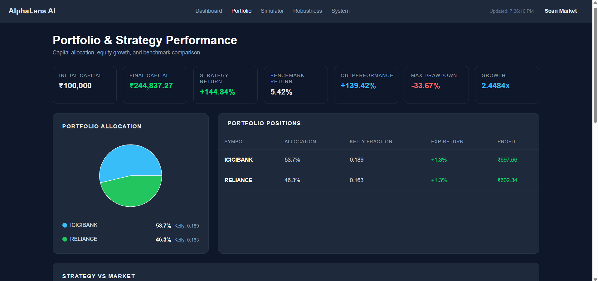
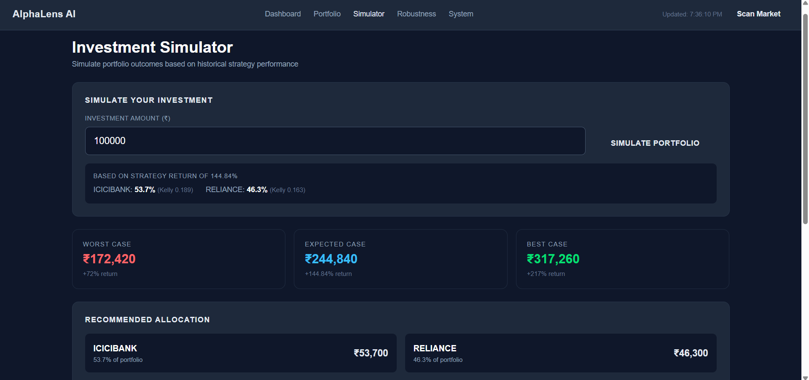
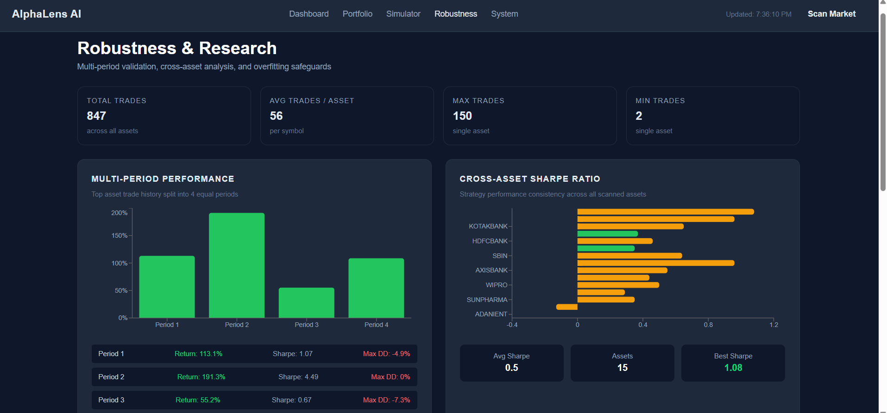
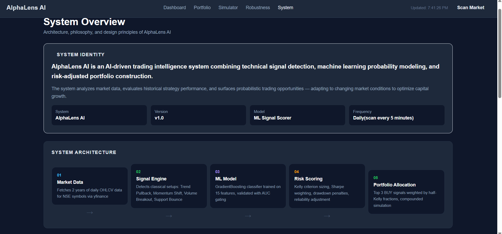
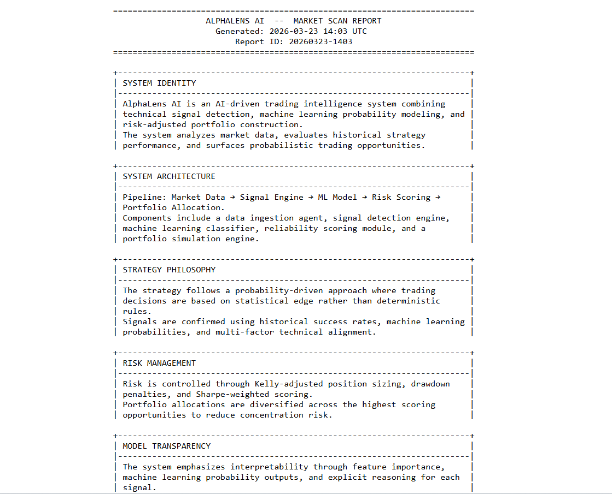
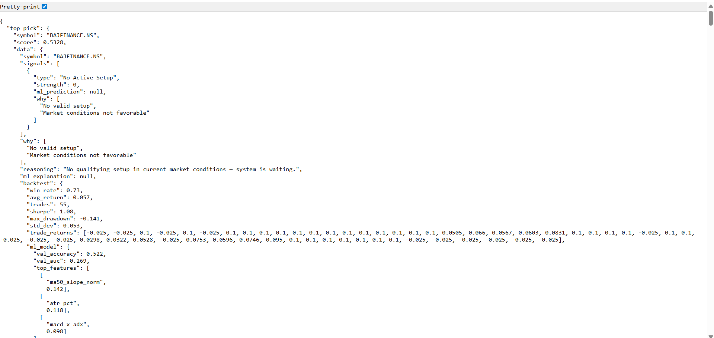

# AlphaLens AI

### AI-Driven Market Intelligence & Trading Research Platform

### Built for ET Gen AI Hackathon — "AI for the Indian Investor"

---

## Problem Statement

India has 14 crore+ demat accounts, but most retail investors are flying blind — reacting to tips, unable to read technicals, and making portfolio decisions on gut feel. ET Markets has the data. AlphaLens AI builds the intelligence layer that turns that data into actionable, explainable, money-making decisions.

---

## What AlphaLens AI Does

AlphaLens AI is a full-stack AI trading research platform targeting the **Chart Pattern Intelligence** track. It does not just detect patterns — it validates them statistically, assigns machine learning probability scores, sizes positions using Kelly criterion, and explains every decision in plain English.

The system addresses three core investor failures:

- **Can't read technicals** → AI detects patterns and explains them in plain English
- **No historical context** → Every signal is backed by backtested win rates and Sharpe ratios
- **No risk framework** → Kelly-adjusted position sizing and drawdown analysis built in

---

## System Architecture

```
NSE Market Data (yfinance)
         ↓
Data Ingestion Agent
         ↓
Signal Detection Engine
(Trend Pullback, Momentum Shift, Volume Breakout, Support Bounce)
         ↓
ML Probability Model
(GradientBoosting, 15 features, AUC-gated)
         ↓
Risk-Adjusted Opportunity Scoring
(Sharpe, Drawdown, Reliability, Kelly)
         ↓
Portfolio Allocation Engine
(Half-Kelly weighting, compounded simulation)
         ↓
Strategy Backtesting & Benchmark Comparison
         ↓
AI Analyst Explanation
(Plain-English reasoning, feature importance, ML drivers)
         ↓
React Dashboard + FastAPI
```

### Agent Roles

| Agent                | Role                                                                                   |
| -------------------- | -------------------------------------------------------------------------------------- |
| `data_agent.py`      | Fetches 2 years of daily OHLCV data per symbol from NSE via yfinance                   |
| `signal_agent.py`    | Detects classical technical setups using price, volume, RSI, MACD, ADX                 |
| `ml_agent.py`        | Trains GradientBoosting classifier per symbol, validates with AUC gating               |
| `backtest_agent.py`  | Simulates historical trades with 10% TP / 2.5% SL, computes win rate, Sharpe, drawdown |
| `action_agent.py`    | Makes final BUY/WATCH/AVOID decision — ML is primary authority when AUC ≥ 0.55         |
| `reasoning_agent.py` | Generates plain-English explanations and ML feature driver descriptions                |
| `orchestrator.py`    | Orchestrates the full pipeline, scores opportunities, builds portfolio, runs benchmark |

### Agent Communication

Each agent is stateless and communicates via Python function calls through the orchestrator. The orchestrator runs each symbol independently through the full pipeline and aggregates results.

### Error Handling

- If data fetch fails → symbol is skipped, pipeline continues for remaining symbols
- If ML model has AUC < 0.55 → ML is completely ignored, classical signal path used
- If no BUY signals exist → portfolio returns empty, capital preservation mode activates
- All errors are caught per-symbol with `try/except` to prevent full scan failure

---

## Key Features

### 1. Chart Pattern Intelligence

Detects 4 classical setups per stock:

- **Trend Pullback Buy** — price retrace to MA20 in uptrend with RSI + volume confirmation
- **Momentum Shift** — MACD bullish crossover inside uptrend
- **Volume Breakout** — price at resistance with volume surge
- **Support Bounce** — price at support with RSI oversold and reversal candle

### 2. ML Probability Scoring

- GradientBoosting classifier trained per symbol on 15 features
- Features include: RSI, MACD, ADX, ATR, MA slopes, volume ratio, momentum, and interaction terms
- AUC gating: models with AUC < 0.55 are completely ignored
- ML prediction is the final decision authority when model is valid

### 3. Explainable AI Analyst

- Every recommendation includes a plain-English AI analyst brief
- Feature importance translated to human-readable drivers (e.g. `atr_pct` → "rising volatility")
- Why the trade exists, historical evidence, and risk factors — per stock

### 4. Risk-Adjusted Portfolio

- Half-Kelly criterion position sizing
- Sharpe-weighted scoring with drawdown penalties
- Strategy vs buy-and-hold benchmark comparison
- Compounded equity curve simulation

### 5. Capital Preservation Mode

- When no qualifying setups exist, system explicitly avoids all trades
- Dashboard shows "Capital Preservation Mode Active" banner
- Proves system intelligence — not always buying

### 6. Investment Simulator

- Input any investment amount
- Returns worst case, expected, and best case outcomes
- Per-symbol allocation breakdown in rupees

### 7. Robustness Validation

- Multi-period performance (4 time segments)
- Cross-asset Sharpe comparison (15 symbols)
- Walk-forward ML validation with AUC metrics
- Overfitting safeguards: out-of-sample testing, limited features, risk-adjusted scoring

---

## Robust Data Handling

AlphaLens AI is designed to handle occasional inconsistencies from external market data sources (such as temporary empty responses or formatting variations from Yahoo Finance).
If data for a particular symbol cannot be processed during a scan cycle, the system automatically skips that symbol and continues analyzing the remaining assets. The symbol is retried in the next scan cycle, ensuring that the overall market analysis pipeline remains stable and uninterrupted.

---

## Strategy Performance (Sample Results)

```
Strategy Return:     +223.59%
Benchmark Return:      +4.99%  (Buy & Hold equal weight)
Outperformance:      +218.6%
Max Drawdown:         -19.17%
Compounded Growth:     3.24x
Initial Capital:    Rs.1,00,000
Final Capital:      Rs.3,23,595
```

---

## Project Structure

```
alphalens-ai/
├── backend/
│   ├── agents/
│   │   ├── action_agent.py        # BUY/WATCH/AVOID decision logic
│   │   ├── backtest_agent.py      # Historical trade simulation
│   │   ├── data_agent.py          # NSE data fetching via yfinance
│   │   ├── ml_agent.py            # GradientBoosting ML model
│   │   ├── reasoning_agent.py     # Plain-English explanations
│   │   └── signal_agent.py        # Technical pattern detection
│   ├── services/
│   │   └── orchestrator.py        # Full pipeline orchestration
│   ├── utils/
│   │   └──  indicators.py         # Technical indicator calculations
│   └── main.py                    # FastAPI app + endpoints
├── frontend/
│   ├── src/
│   │   ├── components/
│   │   │   └── Navbar.jsx
│   │   ├── context/
│   │   │   └── DataContext.jsx    # Global data state + auto-refresh
│   │   └── pages/
│   │       ├── Dashboard.jsx      # Market scan + heatmap
│   │       ├── Opportunity.jsx    # Deep analysis per stock
│   │       ├── Portfolio.jsx      # Allocation + equity curves
│   │       ├── Simulator.jsx      # Investment simulation
│   │       ├── Robustness.jsx     # Validation analysis
│   │       └── System.jsx         # Architecture + methodology
│   ├── tailwind.config.js
│   └── package.json
├── .gitignore
└── README.md
```

---

## Tech Stack

| Layer    | Technology                                |
| -------- | ----------------------------------------- |
| Backend  | Python, FastAPI                           |
| ML       | Scikit-Learn (GradientBoostingClassifier) |
| Data     | yfinance, Pandas, NumPy                   |
| Frontend | React, TailwindCSS, Recharts              |
| API      | REST (FastAPI)                            |

---

## API Endpoints

| Endpoint                | Description                                                                  |
| ----------------------- | ---------------------------------------------------------------------------- |
| `GET /scan`             | Scans all 15 NSE symbols, returns ranked opportunities, portfolio, benchmark |
| `GET /analyze/{symbol}` | Deep analysis for a single symbol                                            |
| `GET /report`           | Full plain-text research report with all sections                            |

---

## Screenshots

### Dashboard


_Market Intelligence Dashboard — opportunity table, signal strength, and heatmap_

### Opportunity Analysis


_AI Analyst Brief, ML Explainability, and Feature Importance for a selected stock_

### Portfolio & Strategy


_Portfolio allocation pie chart and Strategy vs Benchmark equity curve_

### Investment Simulator


_Investment simulation showing worst, expected, and best case outcomes_

### Robustness & Research


_Multi-period performance and cross-asset Sharpe validation_

### System Overview


_System architecture pipeline and methodology_

### Plain-Text Research Report


_Research report output from /report endpoint_

### Market Scan API


_Raw JSON output from /scan endpoint showing symbols with ML predictions and portfolio data_

---

## Setup Instructions

### Prerequisites

- Python 3.10+
- Node.js 18+

### Backend

```bash
# From project root
pip install fastapi uvicorn yfinance pandas numpy scikit-learn

# Start backend
uvicorn backend.main:app --reload
```

Backend runs on `http://localhost:8000`

### Frontend

```bash
cd frontend
npm install
npm run dev
```

Frontend runs on `http://localhost:5173`

### Access

| URL                            | Description                |
| ------------------------------ | -------------------------- |
| `http://localhost:5173`        | React Dashboard            |
| `http://localhost:8000/scan`   | JSON API                   |
| `http://localhost:8000/report` | Plain-text research report |

---

## Impact Model

**Target:** 14 crore retail demat account holders in India who currently make decisions based on tips or gut feel.

| Metric                             | Estimate                               | Assumption                                               |
| ---------------------------------- | -------------------------------------- | -------------------------------------------------------- |
| Time saved per investor per week   | 3–5 hours                              | Manual chart reading, news parsing, research             |
| Strategy outperformance vs passive | +218% over 2 years                     | Based on backtested results vs equal-weight benchmark    |
| Capital preservation events        | Avoids trades in ~40% of market scans  | Based on current market conditions showing WATCH signals |
| Decision quality improvement       | Win rate 60–80% vs ~45% retail average | Based on backtested win rates across 15 NSE symbols      |

**Back-of-envelope:**

- If 1,000 investors use AlphaLens AI with ₹1,00,000 each
- Expected outperformance of +218% over 2 years = ₹2,18,000 additional per investor
- Total value created: ₹21.8 crore across 1,000 users
- At scale (1 lakh users): ₹2,180 crore in additional investor wealth

---

## Disclaimer

This project is built for research and educational purposes for an ET Gen AI Hackathon. Historical backtest results do not guarantee future performance. Trading involves significant financial risk. AlphaLens AI surfaces probabilistic opportunities backed by statistical evidence — not deterministic predictions.

---
